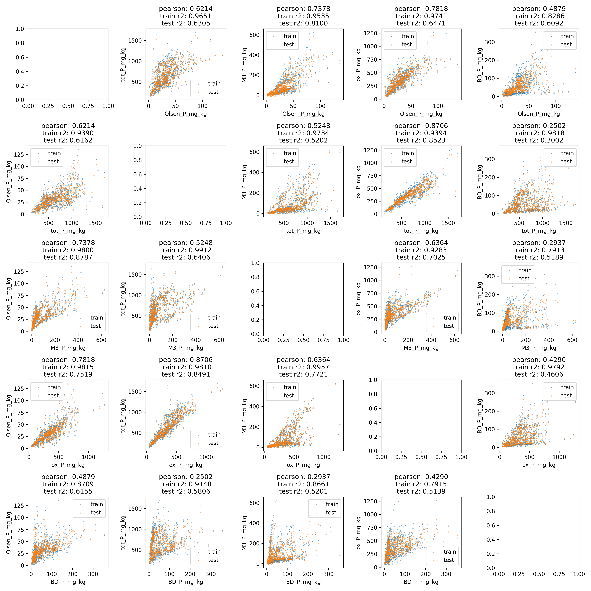

# Phosphorus Metric Conversion

Predict phosphorus quantity with XGBoost based on a different metric plus basic soil features.

## Prerequisites
- Python == 3.10.11
- `pip install -r requirements.txt`

## Usage
```
p-convert.py SRC_METRIC TGT_METRIC [-i INPUT] [-o OUTPUT] 
```
- `SRC_METRIC`, `TGT_METRIC`: Name of the source and the target metric. Must be one of ["Olsen", "tot", "M3", "ox", "BD"].;
- `INPUT`: Path to the input .csv file. Must contain the following columns:
  - `{SRC_METRIC}_P_mg_kg`;
  - `pH`, `TOC_g_kg`, `% Clay`, `% Silt`, `% Sand`.
  - Additionally, the script does not impute any input and will not handle missing data.
- `OUTPUT`: (optional) Path to the output .csv file. If left empty, then the default save path is `./{TGT_METRIC}_pred.csv`.
- In the output file, there will be an additional column named `{TGT_METRIC}_P_mg_kg_pred` which is the predicted phosphorus amount.

## Model Performance
The model used is a XGBoost regressor [1], and trained on [TBD]. The image below shows the r2 score of each predictor. Pairs of values with a testing r2 below 0.6 should be used with caution.


